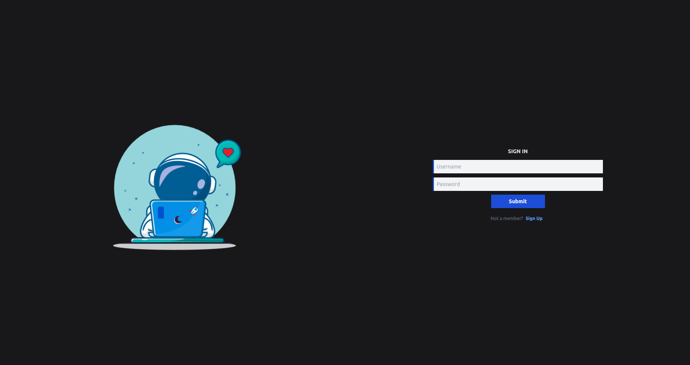
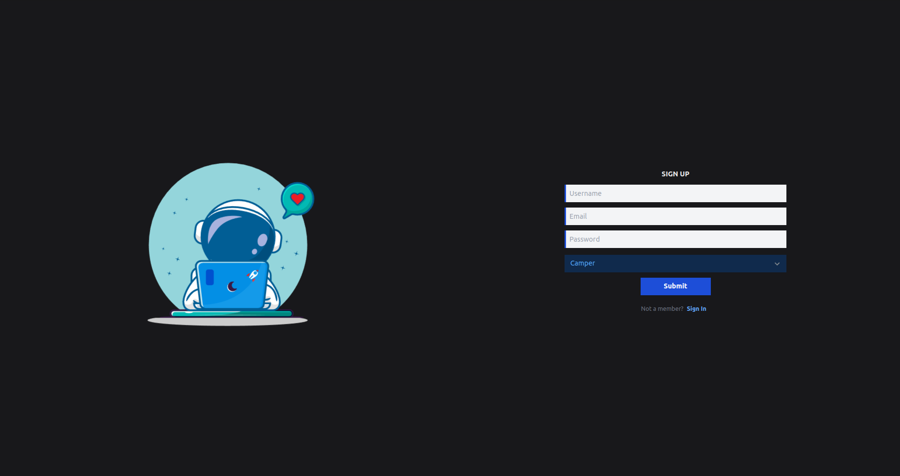
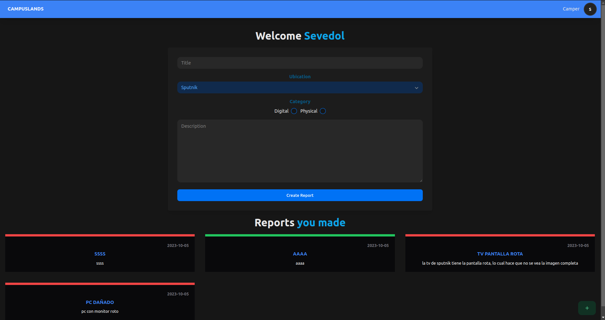
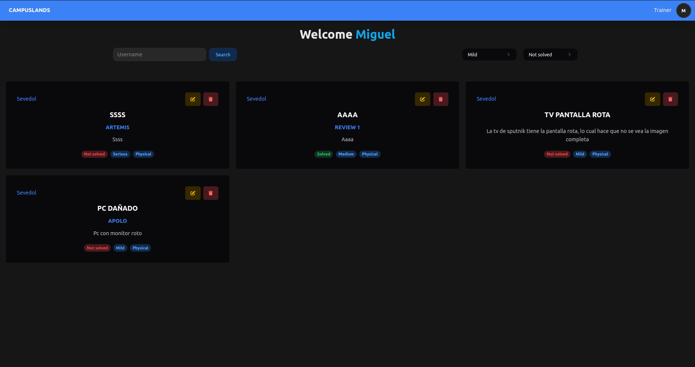
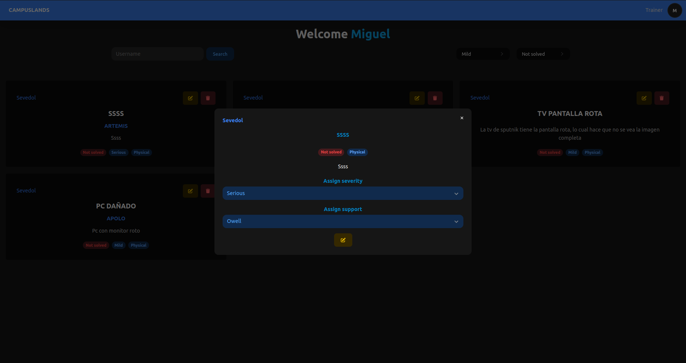
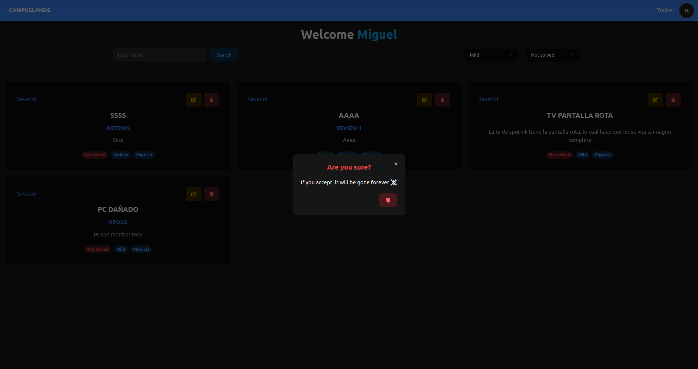
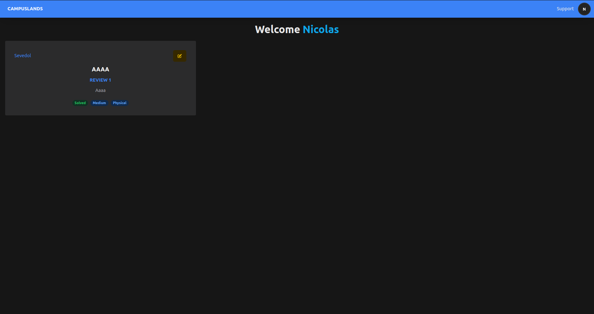
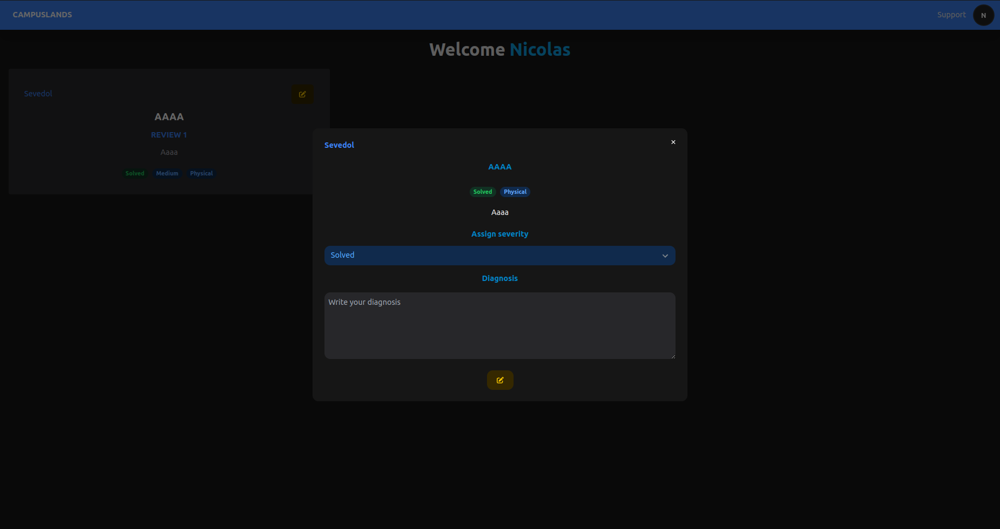

# CampusLands Incidents Management System

Este es un proyecto full stack desarrollado con React JS, Node.js, MongoDB y Express que permite gestionar los reportes de incidencias en CampusLands. La aplicación tiene tres tipos de usuarios: Campers, Trainers y Supports, cada uno con diferentes funcionalidades y permisos.

## Inicio de sesión y registro
En esta vista los usuarios podrán iniciar sesión con sus perfiles o en caso no poseer uno, crearlo.

### Sign in


### Sign up


## Campers


- Iniciar sesión y registrarse en la plataforma.
- Visualizar los reportes de incidencias que han realizado.
- Crear nuevos reportes de incidencias.

**GET** `http://192.168.129.72:5176/v1/reports/user=:username` Para la visualización de sus reportes realizados se ejecuta al cargar la página, para ellos usamos el *username* proveniente del usuario que inicio sesión

**POST** `http://192.168.129.72:5176/v1/campers/newReport`Para la creación de nuevos reportes, los cuales los campers deberán ingresar los datos necesarios para ello

Los Camper al visualizar en las CARDS el estado de los reportees realizados, para ello deben tomar de guia el color del borde superior de dicha CARD
 
 🔴 **NOT SOLVED**

 🔵 **IN PROGRESS**

 🟢 **SOLVED**


## Trainers


- Iniciar sesión y registrarse en la plataforma.
- Visualizar todos los reportes de incidencias.
- Filtrar los reportes para decidir cuáles ver, según diferentes criterios.
- Editar reportes para asignarles una severidad y empleados de soporte para su reparación.

**PUT** `http://192.168.129.72:5176/v1/trainers/report/:id` Permite editar los reportes para asignar una severidad y un empleado de soporte para su mantenimiento.


**DELETE** `http://192.168.129.72:5176/v1/reports/report/:id` Permite editar los reportes para asignar una severidad y un empleado de soporte para su mantenimiento.


**GET** `http://192.168.129.72:5176/v1/reports/status=:status` Permite obtener los reportes mediante su estado actual, por ejemplo, listar todos los reportes que ya se hayan solucionado  🟢 **SOLVED** 🟢

**GET** `http://192.168.129.72:5176/v1/reports/severity=:severity` Permite obtener los reportes mediante su severidad asignada, por ejemplo, listar todos los reportes con la severidad asignada grave/seria **SERIOUS** 

**GET** `http://192.168.129.72:5176/v1/reports/user=:username` Permite obtener los reportes basado en un usuario, ya sea que se desee ver los reportes que tiene asigando un empleado de soporte o listar los realizados por un camper

**GET** `http://192.168.129.72:5176/v1/supports` Permite obtener una lista con información detallada de los empleados de soporte, ya que esta nos permitira listarlos en los select donde se asigna un empleado a dicha incidencia

## Supports


- Iniciar sesión y registrarse en la plataforma.
- Listar los reportes de incidencias a los que han sido asignados para su reparación.
- Editar reportes para asignar un estado (SOLVED, NOT SOLVED, IN PROGRESS).
- Proporcionar su propio diagnóstico sobre el estado y la solución de los reportes.

**PUT** `http://192.168.129.72:5176/v1/supports/report/id=:id` Permite editar los reportes para asiganar un nuevo estado, además de permitirle al soporte dar su propio diagnostico comentario sobre la incidencia.


**GET** `http://192.168.129.72:5176/v1/reports/user=:username` En este caso permite obtener los reportes a los cuales se le ha asignado dicho empleado de soporte.

## Tecnologías Utilizadas

- **Frontend**: React JS se utiliza para crear la interfaz de usuario.
- **Backend**: Node.js y Express.js se utilizan para desarrollar la API RESTful.
- **Base de datos**: MongoDB se utiliza para almacenar los datos de la aplicación.
- **Autenticación**: Se implementa un sistema de autenticación utilizando JWT (JSON Web Tokens).
- **Control de versiones**: Git se utiliza para controlar la versión del código.
- **Gestión de dependencias**: NPM se utiliza para gestionar las dependencias del proyecto.

## Configuración del Proyecto

1. Clona el proyecto
```bash
git pull https://github.com/Jean0405/incidencesReact.git
```

3. En el folder client ejecuta 
```bash
npm install
npm run build
```
2. El folder server ejecuta 
```bash
npm install
npm run dev
```